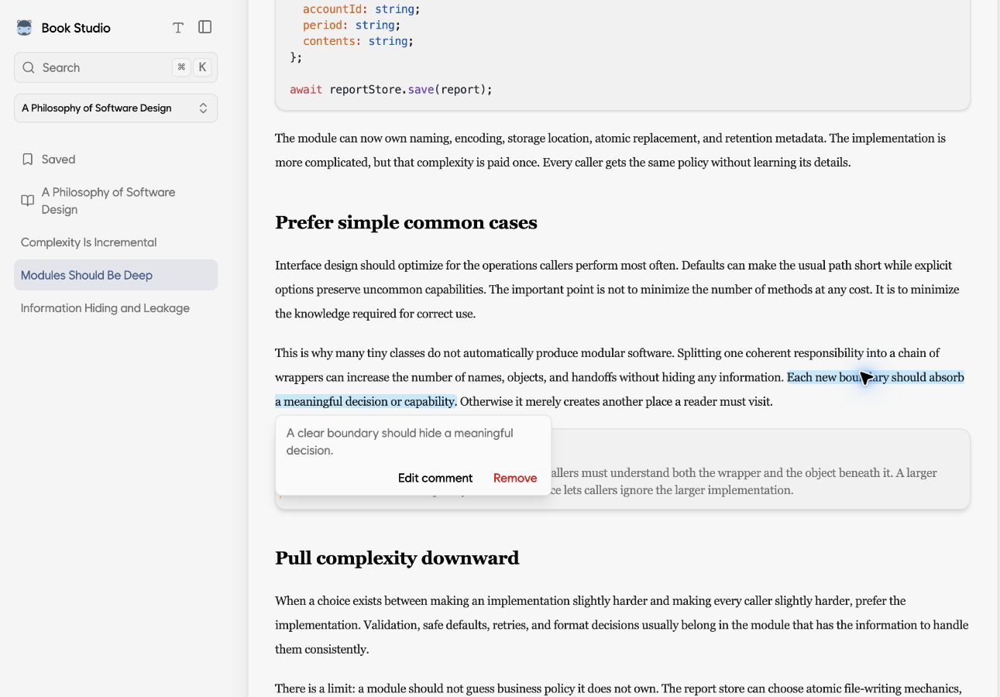
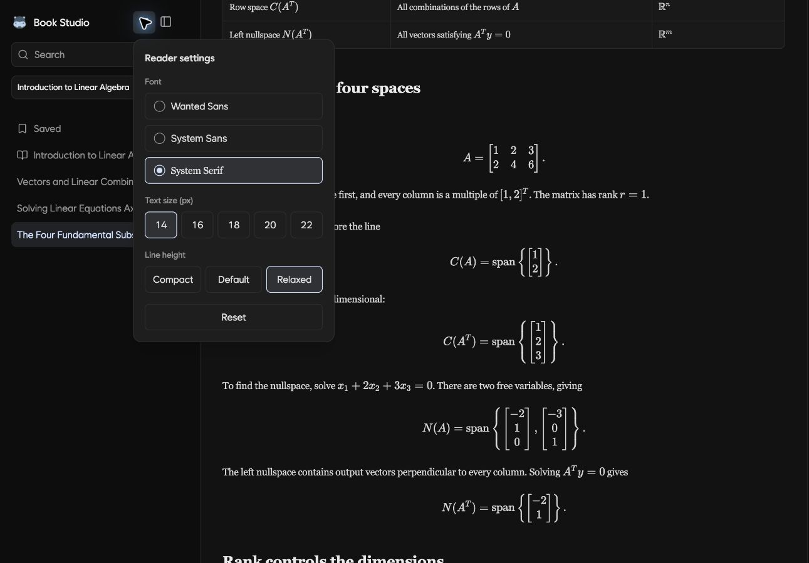
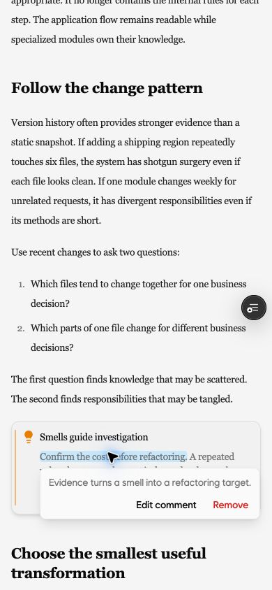
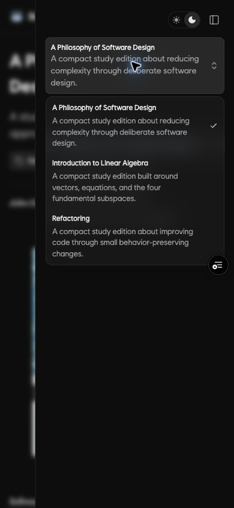

<p align="center">
  <picture>
    <source media="(prefers-color-scheme: dark)" srcset="./public/logo.png">
    <source media="(prefers-color-scheme: light)" srcset="./app/icon.png">
    
  </picture>
</p>

<h1 align="center">Book Studio</h1>

<p align="center">
  <strong>Turn your ugly PDFs into a polished Fumadocs reading experience that only you can access.</strong>
</p>

<p align="center">
  A private, single-owner bookshelf with search, highlights, notes, reading progress, and controlled page sharing.
</p>

<p align="center">
  <a href="https://book-studio-sample.vercel.app">View sample</a>
</p>

<p align="center">
  <a href="https://github.com/mym0404/book-studio-template/generate">
    
  </a>
  <a href=".agents/install-guide.md">
    
  </a>
</p>

<p align="center">
  
  
  
  
</p>

---

## Screenshots

| | Light | Dark |
| --- | --- | --- |
| **Desktop** |  |  |
| **Mobile** |  |  |

> [!IMPORTANT]
> Generated MDX and images are committed to Git. Use a private repository for copyrighted, confidential, or personal material.

## Features

| Feature | What you get |
| --- | --- |
| **Private Bookshelf** | Keep a single-owner library protected by a passkey. |
| **Ready-to-Use PDF Import Skill** | Turn a PDF into a structured, source-checked book with `$import-book`. |
| **Highlights & Comments** | Highlight passages and attach comments while you read. |
| **Continue Reading** | Resume from your latest reading position. |
| **Page Sharing** | Publish one specific page at a time with a stable public link. |

## Deployment

Book Studio requires an HTTPS origin, a server-capable Next.js runtime, and PostgreSQL. The installation guide asks which supported path to use before changing external infrastructure.

| Path | Support | Notes |
| --- | --- | --- |
| **Vercel + Neon** | Guided | Lowest operations; provisions Neon through Vercel Marketplace. |
| **Docker + managed PostgreSQL** | Guided | Portable across managed hosts that build the repository Dockerfile, such as Cloud Run, Fly.io, Railway, and Render. |
| **Docker on Kubernetes or a VPS** | Compatible | Operator-managed; you own ingress, TLS, rollouts, logs, and host maintenance. |
| **Node.js server + PostgreSQL** | Compatible | Run `pnpm build` and `pnpm start`; infrastructure setup is manual. |
| **Platform-specific Next.js adapter** | Provider-dependent | Confirm Next.js 16, Node.js APIs, filesystem assets, streaming, and route-handler support with the provider. |
| **Static export** | Not supported | Passkey authentication, private assets, API routes, and database-backed state require a server. |

## Get Started

1. **Create your repository.** Open [Book Studio](https://github.com/mym0404/book-studio-template), select **Use this template**, and create your repository.
2. **Clone it.**

   ```sh
   git clone https://github.com/YOUR_ACCOUNT/YOUR_REPOSITORY.git
   cd YOUR_REPOSITORY
   ```

3. **Open it.** Open the cloned project in your favorite AI coding agent.
4. **Use your AI agent.** Ask it to follow the [agent installation guide](.agents/install-guide.md):

   ```text
   Read .agents/install-guide.md and install Book Studio.
   ```

## License

The source code, sample PDF, and sample generated content are available under the [MIT License](LICENSE). Imported books remain subject to their original copyright and license terms.
